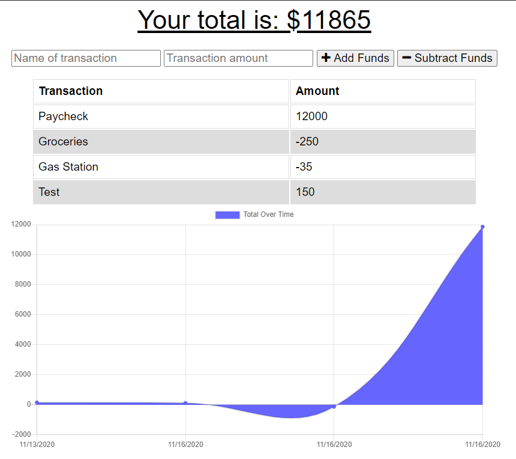
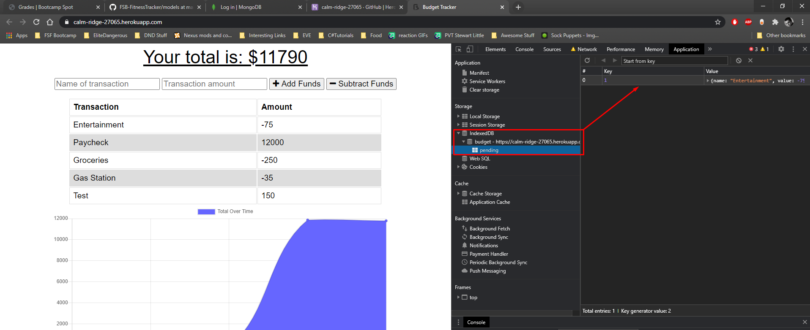

# Budget Tracker
## Description
This is a PWA (Progressive Web App) powered by MongoAtlas and IndexedDB
## Table of Contents
* [Description](#Description)
* [Installation](#Installation)
* [Usage](#Usage)
* [License](#License)
* [Questions](#Questions)

## Installation
Simply visit the live link.
## Usage
You can enter 2 values, a text string and number, that will track expenses or gains. If you are offline then it will store the data until an online connection can be made.
### License
MIT
#### Example Images

#### Live link
[Budget Tracker](https://calm-ridge-27065.herokuapp.com/)

#### Questions?
If you have questions regarding this program: 
Send me a message through GitHub:  
Or through email here: 
